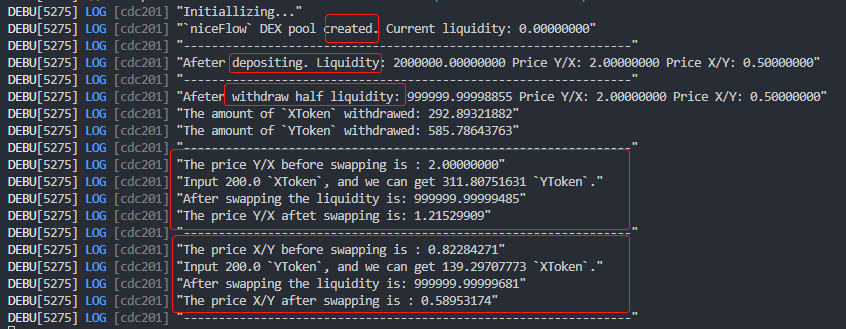

# Omniverse Swap

At this stage, this is just a demo to show how the `Omniverse Swap` based on Dante will work on Flow. So it is implemented just as [Omniverse NFT](../omniverseNFT/) did. 

## Souce Code

The `Omniverse Swap` will be based on an AMM mechanism, the mathematical details of which could be found [here](https://github.com/Omniverse-Web3-Labs/o-amm).  

- [StarToken](./contracts/StarToken.cdc) is used for the liquidity.
- [StarBazzaar](./contracts/StarBazaar.cdc) is the basic part of the swap.

## Demo Test

The demo test of the swap could be found in the [swap example](https://github.com/dantenetwork/flow-sdk/tree/SQoS/exampleApp/swap) in `flow-sdk`.  

- Prepare the environment according to [Test Guide](../test/SQoS-Test/README.md).  
- Go to the directory `flow-sdk/exampleApp/swap`

    ```sh
    cd ../flow-sdk/exampleApp/swap
    ```

- Install the swap environment

    ```sh
    ./init.sh
    ```

- Test 

    ```sh
    flow scripts execute ./scripts/swapTest.cdc 0x01cf0e2f2f715450
    ```

      
