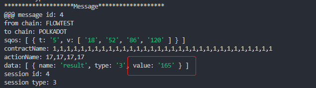
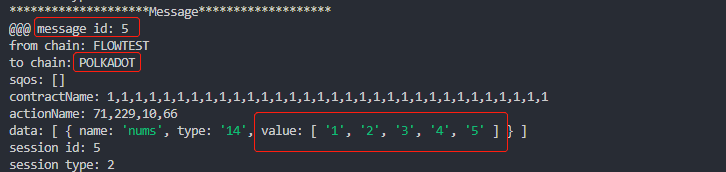
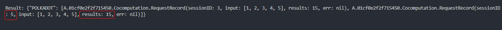
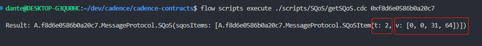

# SQoS Test Guide

this test guide is specific to the functions of the `SQoS`. As the workflow of the `SQoS` is a bit complex, we need some special tools for testing.  
As a result, we have made out a powerful simulator to help us complete the test.  

## Start the emulator

```sh
flow emulator --verbose
```

## Install Dante Protocol for Flow

- Clone the repo

    ```sh
    git clone git@github.com:dantenetwork/cadence-contracts.git -b SQoS
    ```

- Install the Dante protocol

    ```sh
    cd cadence-contracts
    # install
    ./emulator_init.sh
    ```

## Install Test Cases Developed Based on Dante SDK for Flow

- Clone the repo

    ```sh
    cd ..
    # clone
    git clone git@github.com:dantenetwork/flow-sdk.git -b SQoS
    ```

    or `Use this templete` to create a new Dapp based on Dante Protocol.

- Install the test environment: the `computation` smart contracts and resources

    ```sh
    cd flow-sdk/exampleApp/computation

    # install
    ./init.sh
    ```

## Install the simulator

- Clone the repo from GitHub

    ```sh
    cd ..
    # clone
    git clone git@github.com:dantenetwork/flow-off-chain.git -b SQoS
    ```

- Go to the repo

    ```sh
    cd flow-off-chain
    # install
    npm install
    ```

## Testing
### **Prepare**

- Make sure to be in the directory `flow-off-chain`
- Register router:  

    ```sh
    node sqosSimulator.mjs --regrouter
    ```

    - `SEALED` will be found if succeded.
- Register challengers:

    ```sh
    node sqosSimulator.mjs --regchallenger
    ```

    - Two `SEALED` will be found if succeded.

- Go to directory `cadence-contracts` and check the registered routers and challengers

    ```sh
    cd ../cadence-contracts

    flow scripts execute ./scripts/getRouters.cdc
    ```

    - Three routers will be found: `address: 0x01cf0e2f2f715450`, `address: 0xf8d6e0586b0a20c7` and `address: 0x179b6b1cb6755e31`.  

- Go back to directory `flow-off-chain`
    ```sh
    cd ../flow-off-chain
    ```

### **Simplest Situation**

- ***Note that suppose we have put the repos `/cadence-contracts`, `/flow-sdk`, and `/flow-off-chain` in the same directory.***  
- ***Note that all the underlying mechanisms related to cross-chain recource/smart contract invocations are guaranteed by Dante Protocol, and you can find how to use the SDK to interact with Dante [here](https://github.com/dantenetwork/flow-sdk/blob/SQoS/exampleApp/computation/contracts/Cocomputation.cdc).***

The `Simplest Situation` is the basic situation without any special SQoS being set.

#### **Request to resource `ComputationServer` on Flow from POLKADOT**
- Make sure to be in directory `flow-off-chain`
- Simulate send a computation request to `ComputationServer` on Flow from POLKADOT

    ```sh
    node sqosSimulator.mjs --simurequest [11,22,33,44,55]
    ```

    - `[11,22,33,44,55]` is the numbers to be computed
    - Two `SEALED` will be found if succeded
- Check the messages sent from `ComputationServer` on Flow, which is the result responding back to POLKADOT

    ```sh
    node sqosSimulator.mjs --check
    ```

    - The results similar to the following will be found if succeded
    

#### **Send a computation request to POLKADOT from resource `Requester` on Flow**

- Co to the directory `flow-sdk/exampleApp/computation`

    ```sh
    cd ../flow-sdk/exampleApp/computation
    ```

- Send a computation request to POLKADOT from `Requester` on Flow

    ```sh
    flow transactions send ./transactions/CallOut.cdc "POLKADOT" "[1,1,1,1,1,1,1,1,1,1,1,1,1,1,1,1,1,1,1,1,1,1,1,1,1,1,1,1,1,1,1,1]" "[71, 229, 10, 66]" '[1, 2, 3, 4, 5]' --signer emulator-Alice
    ```

    - The numbers need to be computed is `[1, 2, 3, 4, 5]`
    - The other arguments are contract address and action name on a simulated smart contract Parachain of POLKADOT, which are meanless in a simulation.
    - A `SEALED` will be found if succeded.

- Check the message sent from `Requester` on Flow  
      

- Go back to the directory `flow-off-chain`

    ```sh
    cd ../../../flow-off-chain
    ```

- Simulate the computation on POLKADOT and send the result back to `Requester` on Flow

    ```sh
    node sqosSimulator.mjs --simucomputation POLKADOT,5
    ```

    - Two `SEALED` will be found if succeded.  

- Go to the directory `flow-sdk/exampleApp/computation` to check the result

    ```sh
    cd ../flow-sdk/exampleApp/computation
    ```

- Check the results received from POLKADOT in the `Requester` on Flow

    ```sh
    flow scripts execute ./scripts/getComputeResults.cdc 0x01cf0e2f2f715450
    ```

    - The result similar to the following will be found if succeded   
      

This is the normal situation, and next, we will test the situations if errors happen and when SQoS items `hidden & reveal` or `challenge` is set.

### **SQoS Testing Index**

***Note that do the `Error Rollback` test first before doing the others.***

- [Error Rollback](./error-rollback.md)
- [hidden reveal](./hidden-reveal.md)
- [challenge](./challenge.md)

### **Other SQoS Item**
#### **verification threshold**

The threshole of the SQoS is very simple. A message could be submitted by many routers, and the verification of a message is an aggregation of the credibilities of the submitters, which has beed already made out in the first milestone. The `threshold` just determines the value of [passing credibility](../../contracts/ReceivedMessageContract.cdc#L630).

- Go to the directory `cadence-contracts`  
- Set SQoS item `Threshold`
    
    ```sh
    flow transactions send ./transactions/SQoS/setThreshold.cdc 8000
    ```

- Check the SQoS item

    ```sh
    flow scripts execute ./scripts/SQoS/getSQoS.cdc 0xf8d6e0586b0a20c7
    ```

      

    - The `v: [0,0,31,64]` means `8000`, which is 4-byte array transformed from `8000` by `toBigEndianBytes`
    - In addition, we have provide a tool to [transform big-endian-bytes to a number](../../contracts/MessageProtocol.cdc#L564)

#### **Authority context**

The SQoS item `Authority context` is much more simpler, which has already beed made out in milestone 1 too.  
Acutally, this SQoS item is default, and there's no need to set again. It's just the [session context](https://github.com/dantenetwork/flow-sdk/tree/SQoS#high-level-api).  
