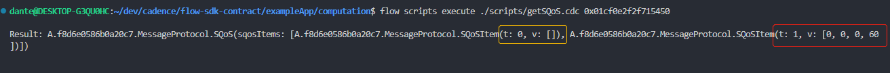
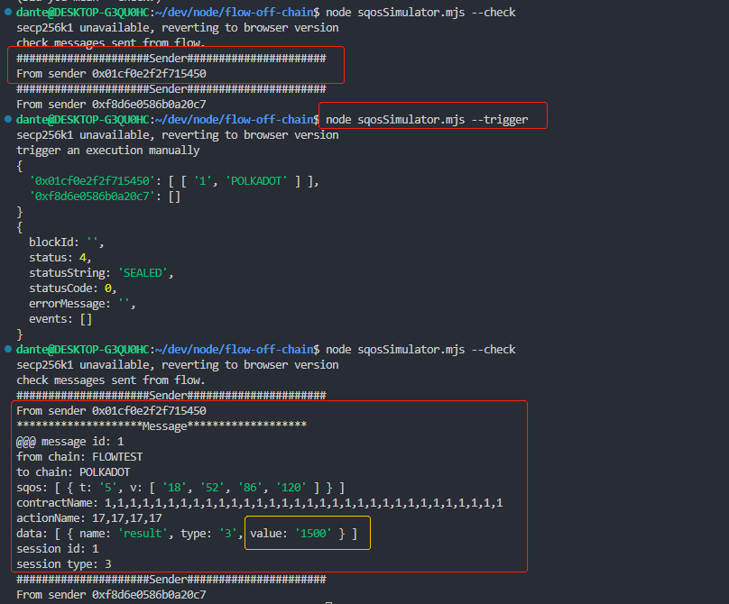
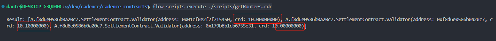
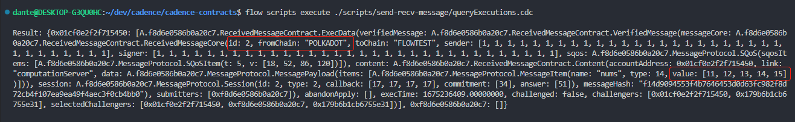
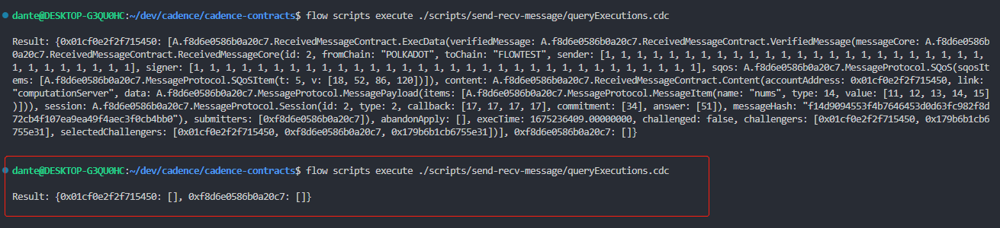
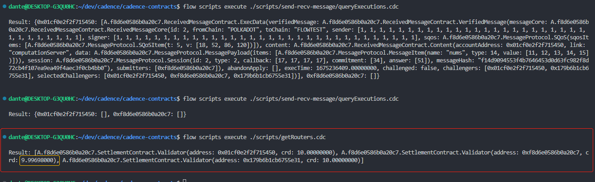
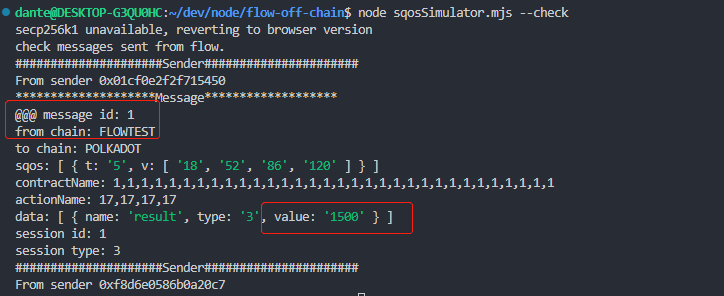

# Challenge

The SQoS item `Challenge` is easy to understand, and the only difference compared with [normal situation](./README.md#simplest-situation) is that before execution, there need to be a waiting time for challenging.  

## Test workflow

- ***Note that suppose we have put the repos `/cadence-contracts`, `/flow-sdk`, and `/flow-off-chain` in the same directory.***  
- ***Note that all the underlying mechanisms related to cross-chain recource/smart contract invocations are guaranteed by Dante Protocol, and you can find how to use the SDK to interact with Dante [here](https://github.com/dantenetwork/flow-sdk/blob/SQoS/exampleApp/computation/contracts/Cocomputation.cdc).***  

### **Source Code Introduction**

- Every off-chain router can make a challenge through [ReceivedMessageContract.makeChallenge](../../contracts/ReceivedMessageContract.cdc#L1119) to a certain submitted message during the challenge time. 
- Before the execution, there needs to be a [judgment](../../contracts/ReceivedMessageContract.cdc#L1088) for the [ReceivedMessageContract.execData](../../contracts/ReceivedMessageContract.cdc#L242).
- The judgment for the `execData` happens in [execData.challengeSettle](../../contracts/ReceivedMessageContract.cdc#L293).  

### **Test Guide**

#### **Set SQoS Item**

- Make sure to be in directory `flow-sdk/exampleApp/computation`
- Set `Challenge` SQoS item

    ```sh
    flow transactions send ./transactions/setOptimistic.cdc --signer emulator-Alice
    ```

- Check the SQoS

    ```sh
    flow scripts execute ./scripts/getSQoS.cdc 0x01cf0e2f2f715450
    ```

      

    - Here we found two SQoS items, `Hidden & Reveal` with `t: 0` and `Challenge` with `t: 1`.
    - The `v: [0,0,0,60]` is the waiting time for challenges, which is a user-defined value of a certain resource [ReceivedMessageContract.ReceivedMessageVault](../../contracts/ReceivedMessageContract.cdc#L331). 
    - The value is a 4-byte array from an `UInt32` number transformed by `toBigEndianBytes`. In this example, `v: [0,0,0,60]` means `60` seconds.  

- To make a more efficient test, it is recommended to delete the SQoS item `Hidden & Reveal` if it is set as `Hidden & Reveal` dividing the submisson to the target chain into two steps.  

    ```sh
    flow transactions send ./transactions/deleteSQoSItem.cdc --signer emulator-Alice 0
    ```

- Check the SQoS

    ```sh
    flow scripts execute ./scripts/getSQoS.cdc 0x01cf0e2f2f715450
    ```

    - Only SQoS item with `t: 1` will be found.  

#### **Request to resource `ComputationServer` on Flow from POLKADOT**

##### **Time up without any challenge happens**

- Go to the directory `flow-off-chain`

    ```sh
    cd ../../../flow-off-chain
    ```

- Submit a request in the [normal way](./README.md#simplest-situation)

    ```sh
    node sqosSimulator.mjs --simurequest [100,200,300,400,500]
    ```

- Check if a result is sent  

    ```sh
    node sqosSimulator.mjs --check
    ```

    - No result will be found. ***But note that sometimes the time in the `emulator` will be error, and the it will be executed immediately. If met this, [restart the emulator](./hidden-reveal.md#make-a-new-environment) and try again.***  

- Wait for `60` seconds and `trigger`  

    ```sh
    node sqosSimulator.mjs --trigger
    ```

- Check if any result is sent

    ```sh
    node sqosSimulator.mjs --check
    ```

      

    - In this case there's no challenge happens, so it is executed after time up.  

##### **Challenge happens**

- Go to the directory `cadence-contracts` to check the credibility of the routers

    ```sh
    cd ../cadence-contracts

    # Check the credibility of the routers
    flow scripts execute ./scripts/getRouters.cdc
    ```

      

    - The credibility of router `0xf8d6e0586b0a20c7` is `10.10000000` because it has successfully submitted a message.  

- Go to the directory `flow-off-chain`

    ```sh
    cd ../flow-off-chain
    ```

- Submit a request in the [normal way](./README.md#simplest-situation)

    ```sh
    node sqosSimulator.mjs --simurequest [11,12,13,14,15]
    ```

- Simulate challenge within `60` seconds

    ```sh
     node sqosSimulator.mjs --simu-make-challenge 2,POLKADOT
    ```

- Go to the directory `cadence-contracts` and check the execution cache

    ```sh
    cd ../cadence-contracts

    # Check the execution cache
    flow scripts execute ./scripts/send-recv-message/queryExecutions.cdc
    ```

      

    - ***Note that sometimes the time in the `emulator` will be error, and the it will be executed immediately. If met this, [restart the emulator](./hidden-reveal.md#make-a-new-environment) and try again.*** 

- Go back to the directory `flow-off-chain` and trigger `60` seconds later  

    ```sh
    cd ../flow-off-chain

    # trigger
    node sqosSimulator.mjs --trigger
    ```

- Go back to the directory `cadence-contracts` and check the execution cache again

    ```sh
    cd ../cadence-contracts

    # Check the execution cache
    flow scripts execute ./scripts/send-recv-message/queryExecutions.cdc
    ```

      

- Check the routers' credibility  

    ```sh
    # Check the credibility of the routers
    flow scripts execute ./scripts/getRouters.cdc
    ```

      

    - The credibility of router `0xf8d6e0586b0a20c7` decreases to `9.99698000` because his second submission is challenged, which may happen when a router submit a malicious message.  

- Go back to the directory `flow-off-chain` and check. As the message is challenged successfully, it might a malicious message, so there won't be any result sent out. 

    ```sh
    cd ../flow-off-chain

    # check
    node sqosSimulator.mjs --check
    ```

      

    - There's only a result related to the **previous request** just the previous [*Time up without any challenge happens*](#time-up-without-any-challenge-happens) did.  
