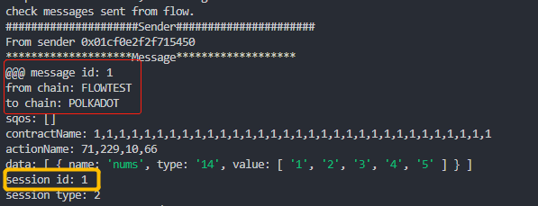
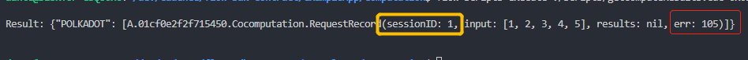
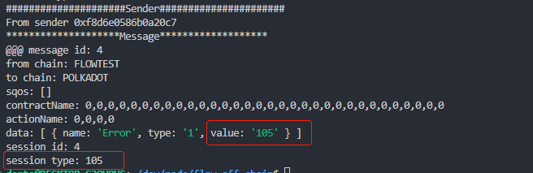

# Error Rollback

This is a very important SQoS item that helps users know whether their remote operations are processed as wished. But an absolute “Error Rollback” is very hard to make out. Consider a situation that when an remote invocation is made from a source chain to a target chain, error happens on the target chain and a rollback reminder is sent from the target chain to the source chain, but unfortunately, the reminder is still error on the source chain, and what shall we do for the next? It is really uncomfortable to engage in an “Error Loop”.  
It seems very hard to solve this problem, but Dante did it. We borrowed the mechanism of [TCP/IP](https://en.wikipedia.org/wiki/Transmission_Control_Protocol) three handshakes. An error won’t loop forever and the performance consumption is acceptable.  

`error rollback` is so necessary that we make it as fixed SQoS item. 

## Test workflow

- ***Note that suppose we have put the repos `/cadence-contracts`, `/flow-sdk`, and `/flow-off-chain` in the same directory.***  
- ***Note that all the underlying mechanisms related to cross-chain recource/smart contract invocations are guaranteed by Dante Protocol, and you can find how to use the SDK to interact with Dante [here](https://github.com/dantenetwork/flow-sdk/blob/SQoS/exampleApp/computation/contracts/Cocomputation.cdc).***  

### **Source Code Introduction**

The remote invocation error may happen in two situations.  
- The one happens when the off-chain router decodes a message read from the source chain and then encodes the information according to the target chain's data structure, as chains in different tech stacks usually have different encoding protocols. This can be caused by invalid ***user-defined*** data structure.  
- The other happens when an invocation is executed after all the verifications. This can be caused by an invalid target smart contract address or action name, and, the failure of the user-defined target smart contract.   

When these errors happen, we need a special mechanism to let the on-chain part know them. So we provide a special interface [ReceivedMessageContract.submitAbandoned](../../contracts/ReceivedMessageContract.cdc#L814) for the off-chain routers to submit the error information.  
After an error message is confirmed, that is, there are enough routers submitting the error information, a `remote error` message will be [sent back](../../contracts/ReceivedMessageContract.cdc#L864) to the source chain and Dante protocol will notify the caller on the source chain of the error information.  

### **Test Guide**

#### **An error happens when a remote invocation is made from Flow to POLKADOT**

- ***Note that if you restart the emulator, remember to [register routers](./README.md#prepare) first before testing.***

- Make sure to be in directory `flow-sdk/exampleApp/computation`
- Send a computation request to POLKADOT from `Requester` on Flow

    ```sh
    flow transactions send ./transactions/CallOut.cdc "POLKADOT" "[1,1,1,1,1,1,1,1,1,1,1,1,1,1,1,1,1,1,1,1,1,1,1,1,1,1,1,1,1,1,1,1]" "[71, 229, 10, 66]" '[1, 2, 3, 4, 5]' --signer emulator-Alice
    ```

    - A `SEALED` will be found if succeded.

- Go to the directory `flow-off-chain`

    ```sh
    cd ../../../flow-off-chain
    ```

- Check the message sent from `Requester` on Flow  
      

- Simulate an remote error happens on POLKADOT, and an information about the error will be sent back to the `Requester` on Flow  

    ```sh
    node sqosSimulator.mjs --simu-remote-error POLKADOT,1
    ```

    - Two `SEALED` will be found if succeded.
- Go to the directory `flow-sdk/exampleApp/computation` to check the result

    ```sh
    cd ../flow-sdk/exampleApp/computation
    ```

- Check the results received from POLKADOT in the `Requester` on Flow

    ```sh
    flow scripts execute ./scripts/getComputeResults.cdc 0x01cf0e2f2f715450
    ```

    - The result similar to the following will be found
          

        - Unlike [normal result](./README.md#L171), which has a valid value of the `result`. Here there is an `err` code `105` without any valid `result`, which means an error happens when making a computation request from the `Requester` on Flow.
        - The session of the request in this case is `1`, which could be found both in the message with id `1` sent out from the `Requester` on flow and the remote error message received by the `Requester` on Flow. We have provided the details of the [Context](https://github.com/dantenetwork/flow-sdk/blob/SQoS/exampleApp/computation/contracts/Cocomputation.cdc#L50) guaranteed by [session mechanism](https://github.com/dantenetwork/flow-sdk/tree/SQoS#high-level-api).  
    
#### **An error happens when a remote invocation from POLKADOT is being submitted to any receiver on Flow**

- Go to the directory `flow-off-chain`

    ```sh
    cd ../../../flow-off-chain
    ```

- Simulate an error happening when submitting a message to any receiver on Flow

    ```sh
    node sqosSimulator.mjs --simu-abandoned POLKADOT
    ```

    - `POLKADOT` is where the message sent from
    - A `SEALED` will be found if succeded
- Check the newest message sent from the underlying `Dante Protocol` on Flow

    ```sh
    node sqosSimulator.mjs --check
    ```

    - The result similar to the following will be found  

          

        - There will be a `remote error` message sent back to `POLKADOT` from Flow  
