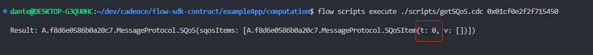
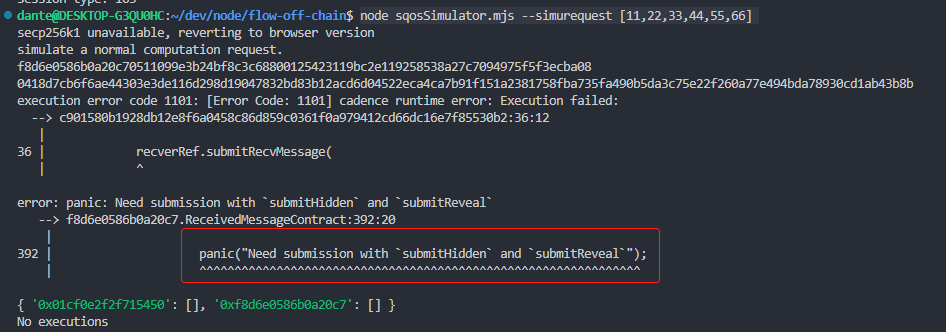

# Hidden & Reveal

From a game theory perspective, under the strategy of majority rule, what is the best solution for an off-chain router that does not actively do evil when every submission is directly plaintext? The answer is submitting the message which is submitted by most of the other routers no matter what the truth is.  
This is the typical situation where SQoS item “Hidden & Reveal” comes into play. Before delivering the plaintext message from source chain to target chain, a cryptographic commitment would be submitted first. Commitments from every router are different from each other even if the related messages are the same. The commitment is unreadable to others. The commitment can be checked when the plaintext message is submitted. It’s very hard to construct a commitment with two different messages.  
With the help of “Hidden & Reveal”, routers that do not actively do evil will carry the true message because they cannot know what is the majority. In general, this item is used to forbid the nodes who are not bad being forced to do malicious things.  

## Test workflow

- ***Note that suppose we have put the repos `/cadence-contracts`, `/flow-sdk`, and `/flow-off-chain` in the same directory.***  
- ***Note that all the underlying mechanisms related to cross-chain recource/smart contract invocations are guaranteed by Dante Protocol, and you can find how to use the SDK to interact with Dante [here](https://github.com/dantenetwork/flow-sdk/blob/SQoS/exampleApp/computation/contracts/Cocomputation.cdc).***  

### **Source Code Introduction**

The submitting process is divided into two steps:  

- [submitHidden](../../contracts/ReceivedMessageContract.cdc#L752)
- [submitReveal](../../contracts/ReceivedMessageContract.cdc#L784)

### **Test Guide**

- To test `Hidden & Reveal` functions better, it is recommended to restart the emulator and re-install the environment. Because there will be no history messages in the output to interupt checking the results. 
    - [Restart the emulator](./README.md#start-the-emulator)
    - [Install Dante Protocol for Flow](./README.md#install-dante-protocol-for-flow)
    - [Install Test Cases Developed Based on Dante SDK for Flow](./README.md#install-test-cases-developed-based-on-dante-sdk-for-flow)
    - [Install the simulator](./README.md#install-the-simulator)
    - [Prepare everything](./README.md#prepare)  

- Make sure to be in directory `flow-sdk/exampleApp/computation`
- Set `Hidden & Reveal` SQoS item

    ```sh
    flow transactions send ./transactions/setHiddenReveal.cdc --signer emulator-Alice
    ```

- Check the SQoS

    ```sh
    flow scripts execute ./scripts/getSQoS.cdc 0x01cf0e2f2f715450
    ```

      

    - `t:0` means the SQoS item `Hidden & Reveal` has been set. Full SQoS defination could be found [here](../../contracts/MessageProtocol.cdc#L264)  

#### **Simulate the Hidden Step**

We simulate sending a computation request from POLKADOT to the `ComputationServer` on Flow with the SQoS item `Hidden & Reveal` to make the test.  

- Go to the directory `flow-off-chain`

    ```sh
    cd ../../../flow-off-chain
    ```

- First we submit a request in the [normal way](./README.md#simplest-situation)

    ```sh
    node sqosSimulator.mjs --simurequest [11,22,33,44,55,66]
    ```

    - A `panic` happens because submitting in the normal way conflicts with `Hidden & Reveal`  
      


#### **Simulate the Reveal Step**
